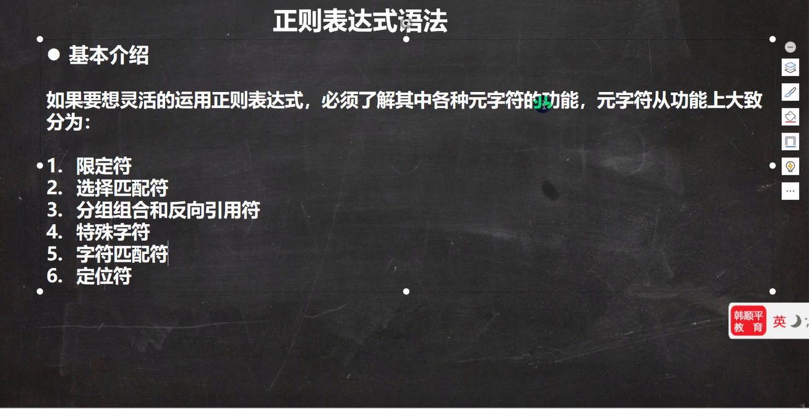
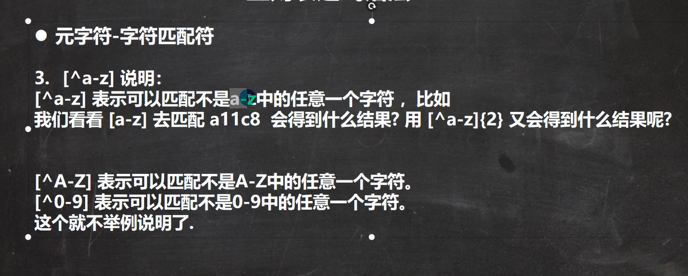

## 介绍

本文档基于B站韩顺平正则表达式教程而整理笔记  [传送地址](https://www.bilibili.com/video/BV1Eq4y1E79W?p=16&spm_id_from=pageDriver)，

## 入门

### 1. 什么是正则表达式

> <font color=#00f> 正则表达式(regular expression)描述了一种字符串匹配的模式（pattern），可以用来检查一个串是否含有某种子串、将匹配的子串替换或者从某个串中取出符合某个条件的子串等。</font>
>
> <font color=#00f>构造正则表达式的方法和创建数学表达式的方法一样。也就是用多种元字符与运算符可以将小的表达式结合在一起来创建更大的表达式。正则表达式的组件可以是单个的字符、字符集合、字符范围、字符间的选择或者所有这些组件的任意组合。</font>
>
> <font color=#00f>正则表达式是由普通字符（例如字符 a 到 z）以及特殊字符（称为"元字符"）组成的文字模式。模式描述在搜索文本时要匹配的一个或多个字符串。正则表达式作为一个模板，将某个字符模式与所搜索的字符串进行匹配.</font>

### 2. 原理剖析

```java
public class Demo {
    public static void main(String[] args) {
        String content = "1995年，互联网的蓬勃发展给了Oak机会。业界为了使死板、单调的静态网页能够“灵活”起来，急需一种软件技术来开发一种程序，" +
                "这种程序可以通过网络传播并且能够跨平台运行。于是，世界各大IT企业为此纷纷投入了大量的人力、物力和财力。这个时候，" +
                "Sun公司想起了那个被搁置起来很久的Oak，并且重新审视了那个用软件编写的试验平台，由于它是按照嵌入式系统硬件平台体系结构进行编写的，所以非常小，" +
                "特别适用于网络上的传输系统，而Oak也是一种精简的语言，程序非常小，适合在网络上传输。Sun公司首先推出了可以嵌入网页并且可以随同网页在网络上传输的Applet（Applet是一种将小程序嵌入到网页中进行执行的技术），并将Oak更名为Java（在申请注册商标时，发现Oak已经被人使用了，再想了一系列名字之后，最终，使用了提议者在喝一杯Java咖啡时无意提到的Java词语）。5月23日，Sun公司在Sun world会议上正式发布Java和HotJava浏览器。IBM、Apple、DEC、Adobe、HP、Oracle、Netscape和微软等各大公司都纷纷停止了自己的相关开发项目，竞相购买了Java使用许可证，并为自己的产品开发了相应的Java平台。";

        // 匹配文中所有单词，输出：找到：Oak 找到：IT 找到：Sun
        // Pattern compile = Pattern.compile("[a-zA-Z]+");
        // 匹配文中所有数字，输出：找到：1995
        // Pattern compile = Pattern.compile("[0-9]+");
        // 匹配数字或者单词
        Pattern compile = Pattern.compile("([0-9]+)|([a-zA-Z]+)");
        // 2.创建一个匹配器对象
        Matcher matcher = compile.matcher(content);
        // 3. 可以循环匹配
        while (matcher.find()) {
            // 匹配内容，文本，放到 m.group(0)
            System.out.println("找到：" + matcher.group(0));
        }
    }
 
```

**查找过程**

1. 根据指定的规则，定位满足规则的字符串，比如2000
2. 找到后将 子字符串的开始索引 group[0]=0 记录到 matcher 对象的 int[] groups数组中；
3. 同时记录oldLast 的值为 子字符串的结束的 索引+1的位置值索引 group[1]=4，下次执行find是，就从记录的索引开始匹配
4. 如果matcher.group(i)，i超过了范围，就会报索引越界异常，因为 getSubSequence(groups[group * 2], groups[group * 2 + 1]).toString();
5. 继续向下找的时候同理, 找到后将 子字符串的开始索引记录 group[0]=65 到 matcher 对象的 int[] groups数组中；同时记录oldLast 的值为 子字符串的结束的 索引+1的位置值索引为group[1]=69，下次执行find是，就从记录的索引开始匹配

---


### 3. 语法

#### 思维导图 




---


#### 转义符


```java
public class Demo {
    public static void main(String[] args) {
        String content = "abc$(a.bc(123(";

        // 俩个 \\ 字符表示 \
        Pattern compile = Pattern.compile("\\(");
        // 2.创建一个匹配器对象
        Matcher matcher = compile.matcher(content);
        // 3. 可以循环匹配
        while (matcher.find()) {
            // 匹配内容，文本，放到 m.group(0)
            System.out.println("找到：" + matcher.group(0));
        }
    }
}
```

---


#### 字符匹配符





```java
public class Demo {
    public static void main(String[] args) {
        String content = "a11c8abcAB\nCy_ABC abc@!  .";

        String reg = "[a-z]"; // 匹配 a-z之间任意一个字符
        String reg1 = "[A-Z]"; // 匹配 A-Z之间任意一个字符
        String reg2 = "abc"; // 匹配 abc字符串(默认区分大小写)
        String reg3 = "(?!)abc"; // TODO 有问题 匹配 abc 字符串(不区分大小写)，a(?!)bc表示bc不区分大小写
        String reg4 = "[0-9]"; // 匹配 0-9之间任意一个字符
        String reg5 = "[^a-z]"; // 匹配 不在 a-z之间任意一个字符
        String reg6 = "[^0-9]"; // 匹配 不在 0-9之间任意一个字符
        String reg7 = "[abcd]"; // 匹配 在 abcd中任意一个字符
        String reg8 = "\\D"; // 匹配 不在 0-9的任意一个字符
        String reg9 = "\\w"; // 匹配 大小写英文字母，数字，下划线
        String reg10 = "\\W"; // 等价于 [^a-zA-Z0-9_]，比如空格，感叹号!，艾特@
        String reg11 = "\\s"; // 匹配任何空白字符(空格，制表符等)
        String reg12 = "\\S"; // 表示，非空白就匹配,与\\s相反
        String reg13 = "\\."; // "."匹配出 \n之外的所有字符，如果要匹配，本身则需要使用 \\.

        Pattern compile = Pattern.compile(reg12);
        // 启用不区分大小写的匹配。
        // Pattern compile = Pattern.compile(reg2, Pattern.CASE_INSENSITIVE);
        Matcher matcher = compile.matcher(content);
        while (matcher.find()) {
            System.out.println("找到：" + matcher.group(0));
        }

    }
}
```


---

#### 选择匹配符


```java
public class Demo {
    public static void main(String[] args) {
        String content = "lauy 木艺术";
        String regStr = "lauy|木|艺";

        Pattern pattern = Pattern.compile(regStr, Pattern.CASE_INSENSITIVE);
        Matcher matcher = pattern.matcher(content);

        while (matcher.find()) {
            System.out.println("找到：" + matcher.group(0));
        }

    }
}
```


---


#### 限定符


```java
public class Demo {
    public static void main(String[] args) {
        String content = "111112141aaaaa1ahello";

        String reg1 = "a{3}"; // 表示匹配 aaa
        String reg2 = "1{4}"; // 表示匹配 1111
        String reg3 = "\\d{2}"; // 表示匹配 两位的任意数字字符

        // 细节：java匹配默认贪婪匹配，尽可能的匹配多的
        String reg4 = "a{3,4}"; //表示匹配aaa 或者 aaaa，优先aaaa多的
        String reg5 = "1{4,5}"; // 表示匹配 1111 或者 11111
        String reg6 = "\\d{2,5}"; // 匹配2位数或者3，4，5，如下会找到找到：11111 和 11

        // + 号使用
        String reg7 = "1+"; // 匹配一个1或者多个1
        String reg8 = "\\d+"; // 匹配一个或多个数字
        String reg11 = "\\d*"; // 匹配0个或多个数字

        // * 号使用
        String reg9 = "1*"; // 匹配0个1或者多个1

        // ? 号使用，遵守贪婪匹配
        String reg10 = "a1?"; // 匹配 a 或者 a1


        Pattern pattern = Pattern.compile(reg11, Pattern.CASE_INSENSITIVE);
        Matcher matcher = pattern.matcher(content);

        while (matcher.find()) {
            System.out.println("找到：" + matcher.group(0));
        }

    }
}
```


---


#### 定位符


```java
public class Demo {
    public static void main(String[] args) {
        String content = "21lauyhelloworld hilauy lauyu Hilauy123";

        // 以至少1个数字开头，后接0或者任意个小写字符串
        String reg1 = "^[0-9]+[a-z]*";
        // 以至少1个数字开头，必须以至少一个小写字母结束,比如仅仅跟 2-lauyhelloworld 匹配，就符合要求
        String reg2 = "^[0-9]+\\-[a-z]+$";

        // 匹配一个单词边界，即字与空格间的位置。如果它位于要匹配的字符串的开始，它在单词的开始处查找匹配项。如果它位于字符串的结尾，它在单词的结尾处查找匹配项。
        // 上述例子，我们可以找字符串结尾处的，比如 21lauyh...，lauyu，lauy123
        String reg3 = "lauy\\b";

        // 和\\b含义相反，详细：面表达式匹配 minelauyo 中的字符串 apt，但不匹配 lauyo 中的字符串 apt：
        String reg4 = "lauy\\B";

        Pattern pattern = Pattern.compile(reg4);
        Matcher matcher = pattern.matcher(content);

        while (matcher.find()) {
            System.out.println("找到：" + matcher.group(0));
        }

    }
}
```


---


#### 分组捕获


```java
public class Demo {
    public static void main(String[] args) {
        String content = "1324324332423";

        /* 捕获分组*/
        String reg1 = "(\\d\\d)(\\d\\d)"; // 匹配4个数字的字符串
        // 命名分组：即可以给分组取名
        String reg2 = "(?<g1>\\d\\d)(?<g2>\\d\\d)";

        Pattern pattern = Pattern.compile(reg2);
        Matcher matcher = pattern.matcher(content);

        while (matcher.find()) {
            /*找到：1324
            找到第一个分组的第一个内容：13
            找到第一个分组的第一个内容：24*/
            System.out.println("找到捕获分组：" + matcher.group(0));
            System.out.println("找到捕获分组的第一个内容：" + matcher.group(1));
            System.out.println("找到捕获分组的第二个内容：" + matcher.group(2));

            /*命名分组方式*/
            // System.out.println("找到捕获分组：" + matcher.group(0));
            // System.out.println("找到第捕获分组的第一个内容：" + matcher.group("g1"));
            // System.out.println("找到第捕获分组的第二个内容：" + matcher.group("g2"));

        }

    }
}
```


---


#### 非捕获分组


```java
public class Demo {
    public static void main(String[] args) {

        /* 非捕获分组，注意不能 matcher.group(1) */
        String content1 = "梦想天空分外蓝啊、分外蓝呀、分外蓝";

        // 等同于 "分外蓝|分外蓝啊|分外蓝呀"
        // 输出：找到非捕获分组：分外蓝啊 找到非捕获分组：分外蓝呀
        String reg3 = "分外蓝(?:啊|呀)";

        // 找到分外蓝关键字，但是要求只是查询 分外蓝啊 和 分外蓝呀 中的分外蓝
        // 输出：找到非捕获分组：分外蓝
        String reg4= "分外蓝(?=啊|呀)";

        // 找到分外蓝关键字，但是要求只是查询匹配 不是 分外蓝啊 和 分外蓝呀 中包含有的分外蓝
        // 输出：找到非捕获分组：分外蓝啊 找到非捕获分组：分外蓝呀
        String reg5= "分外蓝(?:啊|呀)";

        Pattern pattern = Pattern.compile(reg5);
        Matcher matcher = pattern.matcher(content1);

        while (matcher.find()) {
           System.out.println("找到非捕获分组：" + matcher.group(0));
        }

    }
}
```

---


#### 反向引用


```java
public class Demo {
    public static void main(String[] args) {
        // String content = "h1234e155111111abad12321-33344455512211";
        String content = "1221 1111 1111 123213";

        // 匹配两个连续的相同数字：(\\d)\\1
        String reg1 = "(\\d)\\1";
        // 匹配五个连续的相同的数字 11111
        String reg2 = "(\\d)\\1{4}";
        // 匹配个位与千位相同，十位与百位相同的数,匹配1111
        String reg3 = "(\\d)(\\d)\\2\\1";
        // 匹配前面是一个五位数，然后一个 -号，然后是一个九位数，连续的每三位要相同，匹配12321-333444555
        String reg4 = "\\d{5}-(\\d)\\1{2}(\\d)\\2{2}(\\d)\\3{2}";
        // 匹配123213，(\\d)(\\d)(\\d)\\2\\1中 \\2表示反向引用123三个数字中的第二位2，同理\\1,\\3也是如此
        String reg5 = "(\\d)(\\d)(\\d)\\2\\1\\3";

        Pattern compile = Pattern.compile(reg5);
        Matcher matcher = compile.matcher(content);
        while (matcher.find()) {
            System.out.println("匹配格式:" + matcher.group(0));
        }
    }
}
```


---

#### 去重

```java
public class Demo {
    public static void main(String[] args) {
        String content = "我我我要学学学编程java!!!";

        String reg = "(.)\\1+";
        Pattern compile = Pattern.compile(reg);
        Matcher matcher = compile.matcher(content);
        while (matcher.find()) {
            System.out.println("匹配格式:" + matcher.group(0));
        }

        // 使用 反向引用$1 来替换匹配的内容
        String result = Pattern.compile(reg).matcher(content).replaceAll("$1");
        System.out.println("去重后：" + result);
    }
}
```


---


#### 正则匹配URL

```java
public class Demo {
    public static void main(String[] args) {
        String content = "https://mbd.baidu.com/newspage/data/landingsuper?context=%7B%22nid%22%3A%22news_9599029349875218161%22%7D&n_type=0&p_from=1";

        /**
         * 注: \\w：匹配 大小写英文字母，数字，下划线_
         * 1. 匹配 https:// 或者 http:// ：^((http|https)://) 其中^ 表示至少有一个 http 或者 https开头，
         *    (http|https)分组表示http 或者 https
         * 2. 可以匹配不带协议的 url，比如：mbd.baidu.com/newspage/data/landingsuper，
         *    用 正则限定符 ?,指定匹配出现0次或者1次，^((http|https)://)?
         * 3. 匹配 mbd.baidu.com，使用：([\\w-]+\\.)+[\\w]+ ，其中 [\\w-]+ 表示匹配 www-top.com 这种，
         *    中间允许 \\w格式 或者 -，+表示匹配指定字符出现1次多种多次
         * 4. 匹配后面所有 /newspage , [*]在中括号里表示匹配 * 符号
         *    表示 (\\/[\\w-=%.&?]*) 匹配 / 开头，后面接 \\w 和 - 或者 = 或者 % 或者 . 或者 & 或者 ? 格式
         * 5. 第四步(\\/[\\w-=%.&?]*)后面接*表示匹配重复出现0次或者多次，
         * 6. 然后$ ，表示以 /asfssba 这种格式结尾
         */
        // String reg = "^((http|https)://)?([\\w-]+\\.)+[\\w]+(\\/[\\w-=%.&?]*)?$";
        String reg = "^((http|https)://)?([\\w-]+\\.)+[\\w]+(\\/[\\w-=%.&?]*)*$";

        Pattern compile = Pattern.compile(reg);
        Matcher matcher = compile.matcher(content);
        if (matcher.find()) {
            System.out.println("匹配格式" + matcher.group(0));
        } else {
            System.out.println("不匹配格式");
        }
    }
}
```


------


### 4. 常用类


 


---


### 5. String类中使用正则表达式

```java
public class StringReg {
    public static void main(String[] args) {
        String content = "2000年5月，JDK1.3、JDK1.4和J2SE1.3相继发布，几周后其获得了Apple公司Mac OS X的工业标准的支持。" +
                "2001年9月24日，J2EE1.3发布。2002年2月26日，J2SE1.4发布。自此Java的计算能力有了大幅提升，与J2SE1.3相比，" +
                "其多了近62%的类和接口。在这些新特性当中，还提供了广泛的XML支持、安全套接字（Socket）支持（" +
                "通过SSL与TLS协议）、全新的I/OAPI、正则表达式、日志与断言。2004年9月30日，J2SE1.5发布，成为Java语言发展" +
                "史上的又一里程碑。为了表示该版本的重要性，J2SE 1.5更名为Java SE 5.0（内部版本号1.5.0），代号为“Tiger”" +
                "，Tiger包含了从1996年发布1.0版本以来的最重大的更新，其中包括泛型支持、基本类型的自动装箱、改进的循环、枚举类型、" +
                "格式化I/O及可变参数。";

        //使用正则表达式将JDK1.3和JDK1.4替换为JDK
        content = content.replaceAll("JDK1\\.3|JDK1\\.4", "JDK");
        System.out.println(content);

        //要求验证一个手机号， 要求必须是138 139开头的
        content = "13888889999";
        if(content.matches("1(38|39)\\d{8}")) {
            System.out.println("success");
        } else {
            System.out.println("fail");
        }


        //分割字符串
        content = "hello#abc-jack12smith~北京";
        String[] split = content.split("#|-|~|\\d+");
        for(String s : split) {
            System.out.println(s);
        }
    }
}
```

